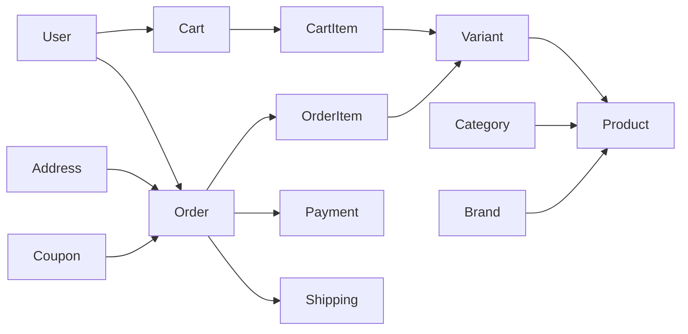

# BÁO CÁO DATABASE — KIỂM KÊ DỮ LIỆU BÁN HÀNG

## 1. Mốc kiểm kê

- Repository: `thodz06012005-blip/dien-lanh-247`
- Baseline SHA: `9e5d79af36d67fabc2418e35f7de2e5324153814`
- Ngày: 2026-07-18
- Phạm vi: schema Prisma, 7 migration, Prisma seed, mock seed/JSON và code query liên quan.
- Giai đoạn 0 không xóa, đổi tên, migrate hay cập nhật dữ liệu.

## 2. Nguồn dữ liệu hiện có

| Nguồn | Vai trò | Trạng thái kiểm kê |
|---|---|---|
| MySQL + Prisma | Backend production/staging | Không có instance trong môi trường kiểm định; chưa lấy được row count thật |
| `backend/prisma/schema.prisma` | Prisma Client cho mô hình lõi | Validate PASS nhưng thiếu nhiều cấu trúc đã được migration thêm |
| `backend/prisma/migrations/**` | Lịch sử schema thật | 7 migration từ init đến Phase 12 |
| `backend/prisma/seed.ts` | Seed core catalog, coupon và service | Có 6 product, 6 variant, 3 coupon; yêu cầu `ADMIN_SEED_PASSWORD` |
| `mock-api/mock-db.json` | Dữ liệu demo có thể bị test ghi | Đã đọc và đếm baseline |
| `mock-api/seed/initialData.js` | Nguồn reset mock | Có 15 product, 3 order và dữ liệu dịch vụ |
| `mock-api/scripts/reset-db.js` | Reset demo/dev | Phải giữ dev-only guard |

## 3. Số lượng dữ liệu mock tại thời điểm khóa

| Collection | Số lượng |
|---|---:|
| categories | 9 |
| brands | 8 |
| products | 15 |
| orders | 3 |
| customers | 2 |
| contacts | 0 |
| serviceCategories | 6 |
| serviceRequests | 4 |
| technicians | 4 |
| auditLogs | 4 |
| settings | 1 object |

Đây là số lượng của mock JSON, không đại diện production. Test mock có reset và tạo order/technician nên không dùng file sau test làm bằng chứng dữ liệu production.

## 4. Mô hình bán sản phẩm trong Prisma

| Model/enum | Chức năng | Phụ thuộc chính | Phân loại tương lai |
|---|---|---|---|
| `Category` | Danh mục sản phẩm | parent/children, Product | Ứng viên bỏ phần catalog; kiểm tra CMS taxonomy trước |
| `Brand` | Hãng sản phẩm | Product | Ứng viên bỏ nếu service không dùng hãng thiết bị |
| `Product` | Sản phẩm bán | Category, Brand, Variant, Image, Review | Ứng viên archive/remove |
| `ProductImage` | Ảnh sản phẩm | Product cascade | Ứng viên archive/remove; tách asset dùng lại trước |
| `Variant` | SKU, giá và tồn kho | Product, CartItem, OrderItem | Ứng viên archive/remove |
| `Cart` | Giỏ theo user | User, CartItem | Ứng viên remove sau khi route/account tách |
| `CartItem` | Dòng giỏ | Cart, Variant | Ứng viên remove |
| `Order` | Đơn bán sản phẩm | User, Address, Item, Payment, Shipping, Coupon | Ứng viên archive/remove |
| `OrderItem` | Snapshot sản phẩm lúc mua | Order, Variant | Phải lưu lịch sử trước khi drop |
| `Payment` | Thanh toán đơn bán | Order | Không được gộp với `ServicePaymentRecord` |
| `Shipping` | Giao hàng đơn bán | Order | Ứng viên remove |
| `Coupon` | Mã giảm giá đơn bán | Order | Không được xóa discount của ServiceQuote |
| `Review` | Đánh giá sản phẩm | User, Product | Tách khỏi `ServiceRequestReview` |
| `OrderStatus` | Lifecycle đơn bán | Order | Ứng viên remove sau khi API/UI dừng dùng |
| `PaymentMethod`, `PaymentStatus` | Trạng thái/method của Order Payment | Order service/admin | Giữ độc lập với string contract dịch vụ |
| `ShippingStatus` | Lifecycle giao hàng | Shipping | Ứng viên remove |
| `DiscountType` | Loại Coupon | Coupon | Không áp trực tiếp lên quote service |

### 4.1. Chuỗi khóa ngoại bán hàng

Không drop `Product` trước `Variant`, `CartItem`, `OrderItem`, `ProductImage`, `Review`; không drop `Order` trước `OrderItem`, `Payment`, `Shipping`; không drop `User` hoặc `Address` vì đây là dữ liệu dùng chung.

## 5. Mô hình dịch vụ bắt buộc bảo toàn

### 5.1. Trong schema Prisma lõi

- `ServiceCategory`, `ServiceRequest`, `Technician`.
- `User`, `Address`, `Contact`, `SystemSetting` được dịch vụ/CRM dùng chung.

### 5.2. Do migration Phase 6–12 tạo hoặc mở rộng

| Phase | Bảng/cột dịch vụ phải giữ |
|---|---|
| 6 | cột workflow trên `ServiceRequest`; `ServiceRequestStatusEvent`, `ServiceRequestMedia`, `ServiceRequestAudit` |
| 7 | `customerUserId`; `AuthSession`, token xác minh/khôi phục, `CustomerNotification`, `ServiceRequestReview` |
| 10 | `CustomerDevice`, `TechnicianSchedule`, `SlaPolicy`, `ServiceRequestSla`, `DispatchAssignment`, `ServiceRequestInternalNote` |
| 10 | `ServiceQuote`, `ServiceQuoteLine`, `ServicePaymentRecord`, `CompletionReport`, `WarrantyRecord`, `WarrantyEvent` |
| 12 | `NotificationOutbox`, `AdminNotification`, `IntegrationDeliveryLog` |

### 5.3. Payment và discount không được đánh đồng

| Bán sản phẩm | Dịch vụ sửa chữa |
|---|---|
| `Payment.orderId` | `ServicePaymentRecord.requestId` và `quoteId` |
| `Coupon` + `Order.couponId` | `ServiceQuote.discountType`, `discountValue`, `discountAmount` |
| `Payment.amount` theo Order | payment record có thể nhiều lần theo request |
| gateway VNPay nằm ở integration chung nhưng hiện hướng về order | payment dịch vụ hiện được Operations ghi nhận |

Tên trường giống nhau không chứng minh cùng aggregate. Migration tương lai phải dùng namespace/contract riêng.

## 6. Seed và dữ liệu mẫu chịu ảnh hưởng

### 6.1. Prisma core seed

| Nhóm | Seed hiện có |
|---|---:|
| Product category | 1 danh mục gốc + 6 danh mục con |
| Brand | 8 |
| Product | 6 |
| Variant | 6, mỗi product một variant |
| Coupon | 3: `DIENLANH247`, `GIAM50K`, `MIENPHIYENTAM` |
| Service category | 6 |
| Technician | 4 |
| Service request | 2 |

Không xóa toàn bộ `seed.ts` khi bỏ bán hàng. Cần tách `seed-commerce.ts` và `seed-service-core.ts`, sau đó giữ chuỗi `prisma:seed` tương thích.

### 6.2. Mock seed

`initialData.js`, `reset-db.js` và `mock-db.json` đang trộn product/order với service request/technician/settings. Cần tách fixture theo domain trước khi gỡ collection để test dịch vụ không mất dữ liệu nền.

## 7. Dashboard metric chịu ảnh hưởng

### 7.1. Metric bán hàng phải thay thế

- `todayRevenue` từ Order `DELIVERED`;
- `totalOrders`, `pendingOrders`;
- `totalProducts`;
- `lowStockVariants`;
- chart `revenue7d`, `orderStatus`;
- `recentOrders`, `lowStock`;
- attention `stale_order` và `low_stock`.

### 7.2. Metric dịch vụ phải giữ

- `openServiceRequests`;
- `activeTechnicians`;
- chart `serviceStatus`;
- urgent service attention;
- Operations overview: customers, devices, technicians, active request, SLA breach, unpaid accepted quote, active warranty và `serviceRevenue30Days`.

Dashboard không được xóa nguyên module. Giai đoạn sau cần thay KPI commerce bằng KPI service trước, rồi mới loại query Order/Product.

## 8. Phát hiện P0: Prisma schema không đồng bộ lịch sử migration

`prisma validate` PASS chỉ chứng minh cú pháp hiện tại hợp lệ. So sánh cho thấy `schema.prisma` không chứa:

- các cột Phase 6 trên `ServiceRequest` như `workflowStatus`, `scheduledAt`, `completedAt`;
- `customerUserId` và bảng account security Phase 7;
- toàn bộ model content Phase 5/9;
- toàn bộ operations/quote/payment/warranty Phase 10;
- bảng notification/integration Phase 12.

Một số service dùng `$queryRawUnsafe`/`$executeRawUnsafe` để truy cập các bảng không có trong Prisma Client, vì vậy build vẫn qua. Rủi ro:

1. `prisma migrate dev` có thể đề xuất migration ngoài ý muốn;
2. reset/shadow database có thể cho kết quả khác production;
3. introspection hoặc schema generate không phản ánh contract đầy đủ;
4. việc drop commerce từ schema có thể che mất drift dịch vụ;
5. backup/restore verification khó xác định đủ bảng cần kiểm tra.

Đây là blocker trước mọi destructive migration. Cần dựng MySQL từ đầu bằng 7 migration, chạy `prisma db pull --print` để đối chiếu, rồi cập nhật schema theo hướng additive trong một PR riêng. Không chạy `db push` lên production.

## 9. Migration và backup/restore baseline

### 9.1. Migration inventory

1. `20260629000000_init_backend_schema`
2. `20260714050000_phase5_managed_content`
3. `20260714060000_phase6_service_request_lifecycle`
4. `20260714100000_phase7_customer_account_security`
5. `20260714210000_phase9_editorial_cms`
6. `20260715090000_phase10_operations_dispatch`
7. `20260715160000_phase12_communications_integrations`

Không có migration riêng mang tên Phase 8, 11, 13, 14 hoặc 15; các phase này chủ yếu dùng cấu trúc có sẵn hoặc thay đổi code/vận hành.

### 9.2. Kết quả có thể chạy

- `prisma validate`: PASS.
- `prisma generate`: PASS.
- secret scan và syntax backup/restore utility: PASS.

### 9.3. Hạng mục bị chặn

Môi trường kiểm định không có Docker, MySQL server, `mysql` và `mysqldump`. Do đó chưa thể xác nhận:

- deploy đủ 7 migration trên DB trống;
- migration status trên snapshot thật;
- seed đầy đủ;
- backup `.sql.gz` và checksum;
- restore vào DB tạm;
- row count, foreign key, sentinel, RPO/RTO sau restore.

Không tạo SQL giả để đánh dấu hoàn thành. Giai đoạn tiếp theo phải cung cấp MySQL sandbox và credential riêng, không dùng production.

## 10. Trình tự dữ liệu an toàn cho chuyển đổi

1. **Expand:** thêm contract/view service mới, chưa xóa commerce.
2. **Observe:** log usage endpoint, route và bảng commerce tối thiểu một chu kỳ vận hành.
3. **Archive:** snapshot bảng commerce, checksum, row count, manifest và retention owner.
4. **Switch reads:** UI/dashboard/account chỉ đọc service contract mới.
5. **Disable writes:** khóa tạo cart/order/product mới bằng feature flag hoặc 410 có kế hoạch.
6. **Verify:** test service, notification, quote/payment, backup/restore và rollback.
7. **Contract:** mới tạo migration drop FK/table theo thứ tự phụ thuộc.

## 11. Checklist database trước khi cho phép drop

- [ ] Có MySQL sandbox tái tạo được từ 7 migration.
- [ ] `prisma migrate status` sạch.
- [ ] `schema.prisma` đồng bộ migration Phase 5–12.
- [ ] Row count production/staging của mọi bảng commerce được ghi và ký xác nhận.
- [ ] Backup `.sql.gz` có SHA-256 hợp lệ.
- [ ] Restore vào DB tạm thành công và query sentinel đúng.
- [ ] Xác nhận dữ liệu pháp lý cần lưu của Order/Payment/Invoice/Customer.
- [ ] Dashboard, account và operations không còn query bảng commerce bị drop.
- [ ] ServiceQuote/ServicePaymentRecord không bị chạm.
- [ ] Rollback runbook và thời gian phục hồi được thử thật.

## 12. Kết luận

Dữ liệu bán sản phẩm có thể tách khỏi dịch vụ nhưng hiện còn liên kết ở User, Address, Dashboard, Settings, Operations customer detail, notification và seed. Chưa đủ điều kiện drop bất kỳ bảng nào. Ưu tiên P0 tiếp theo là khắc phục schema drift và thực hiện migration + backup/restore drill trên MySQL sandbox.
