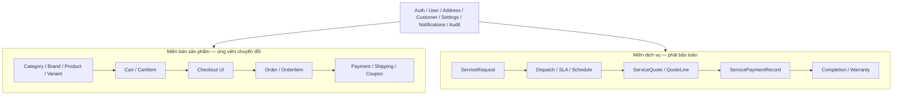

# BÁO CÁO HỆ THỐNG — BASELINE TRƯỚC CHUYỂN ĐỔI

## 1. Thông tin kiểm kê

| Thuộc tính | Giá trị |
|---|---|
| Ngày khóa baseline | 2026-07-18 (Asia/Bangkok) |
| Repository | `thodz06012005-blip/dien-lanh-247` |
| Nhánh nguồn được chọn | `refactor/phase-15-file-image-organization` |
| SHA nguồn bất biến | `9e5d79af36d67fabc2418e35f7de2e5324153814` |
| Nhánh Giai đoạn 0 | `agent/phase-0-baseline-inventory` |
| Phạm vi thay đổi | Chỉ thêm tài liệu kiểm kê; không sửa logic, schema, route, UI hay dữ liệu |

## 2. Kết luận khóa nền

Nhánh `refactor/phase-15-file-image-organization` được chọn làm nền vì đáp ứng đồng thời ba điều kiện bắt buộc:

1. chứa toàn bộ `agent/phase-14-security-hardening`;
2. chứa toàn bộ `agent/phase-15-production-readiness`;
3. có thêm 18 commit tổ chức tệp và hình ảnh sau Phase 15.

Đối chiếu lịch sử GitHub:

| So sánh | Trạng thái | Kết quả |
|---|---|---|
| Phase 14 → Phase 15 | `ahead` | Phase 15 đi trước 94 commit, không thiếu commit Phase 14 |
| Phase 15 → nhánh tổ chức ảnh | `ahead` | Nhánh tổ chức ảnh đi trước 18 commit, không thiếu commit Phase 15 |
| `main` → nhánh tổ chức ảnh | `ahead` | Nhánh được chọn đi trước `main` 663 commit |
| Nhánh tổ chức ảnh → `main` | `behind` theo chiều so sánh ngược | `main` không có commit mới vượt mốc đã chọn |

Không dùng `integration/final-project-consolidation` vì nhánh này đã phân kỳ: thiếu một commit so với dòng riêng của nó trong khi nhánh tổ chức ảnh có 665 commit ở phía còn lại. Không sửa trực tiếp `main`.

## 3. Nguyên tắc bất biến cho các giai đoạn sau

- Không xóa Product, Cart, Checkout, Order, Inventory, Shipping, Return, Coupon, Promotion hoặc permission trong Giai đoạn 0.
- Mọi endpoint trong `DS_API_endpoint-can-go-bo.csv` chỉ là **ứng viên**, chưa phải lệnh xóa.
- Không coi `Payment` của đơn hàng và `ServicePaymentRecord` của dịch vụ là cùng một nghiệp vụ.
- Không coi `Coupon` của bán hàng và giảm giá trong `ServiceQuote` là cùng một cấu trúc dữ liệu.
- Không dùng việc bỏ bán sản phẩm để xóa nhầm `Customer`, `Address`, `Auth`, `Notification`, `Audit`, `Settings`, media hoặc nội dung CMS dùng chung.
- Mỗi giai đoạn sau phải giữ build/typecheck và test dịch vụ hiện có; mọi thay đổi route phải có redirect hoặc màn hình thay thế trước khi route cũ bị gỡ.
- Ảnh, hoạt cảnh và bố cục chỉ được thay đổi sau khi có ma trận route–component–API và tiêu chí hồi quy tương ứng.

## 4. Baseline kỹ thuật

### 4.1. Môi trường

Repo khai báo Node `>=22.0.0 <23` và bật `engine-strict`. Máy kiểm định mặc định dùng Node `24.14.0`, vì vậy lần `npm ci` đầu tiên bị chặn bằng `EBADENGINE`. Baseline chính thức được chạy lại với Node `22.22.0` tạm thời, không sửa `.npmrc` và không nới hợp đồng engine của dự án.

### 4.2. Kết quả lệnh kiểm định

| Hạng mục | Lệnh/điều kiện | Kết quả | Bằng chứng chính |
|---|---|---|---|
| Clean install | `npm ci` và `npm run bootstrap` trên Node 22.22.0 | PASS | Cài root và bốn workspace từ lockfile |
| Repository contract | `npm run validate:repo` | PASS | 33 tệp bắt buộc, 681 tệp tracked |
| Secret scan | `npm run security:scan` | PASS | Không phát hiện credential độ tin cậy cao |
| Image audit | `npm run assets:audit` | PASS có cảnh báo | 20 manifest entry, 0 tệp bắt buộc bị thiếu, 81 external reference chưa được tài liệu hóa |
| Lint | `npm run lint` | PASS có cảnh báo | 0 lỗi, 252 cảnh báo backend |
| Typecheck | `npm run typecheck` | PASS | user, admin và backend đều qua |
| Architecture tests | `npm run test:architecture` | PASS | 98/98 test: root 66, user 19, admin 9, backend 4 |
| Build customer | `npm run build:user` | PASS | Vite build thành công |
| Build admin | `npm run build:admin` | PASS có cảnh báo | JS chính 759.38 kB; dynamic import `adminAuthStore` không tách chunk |
| Build backend | `npm run build:backend` | PASS | Nest build thành công |
| Mock functional tests | mock API chạy bằng `npm run dev`, sau đó `npm run test:mock` | PASS | Pricing/order, lifecycle, technician và enum contract đều qua |
| Backend unit tests | `npm run test:unit` | FAIL — tồn tại trước GĐ0 | 4/17 suite qua, 13/17 suite hỏng; 11/24 test qua, 13/24 test hỏng |
| Prisma schema | `npm run prisma:validate` | PASS | Schema hợp lệ về cú pháp |
| Prisma Client | `npm run prisma:generate` | PASS | Client 6.4.0 sinh thành công |
| Migration inventory | kiểm tra `backend/prisma/migrations` | PASS kiểm kê | 7 thư mục migration |
| Migration deploy/status với DB thật | yêu cầu MySQL | BLOCKED | Môi trường không có MySQL/Docker và không có database test |
| Backup/restore drill thật | yêu cầu `mysqldump`, `mysql`, MySQL | BLOCKED | Không có các binary và database đích; không được đánh dấu PASS giả |
| Backup/restore static safety | `npm run security:check` | PASS | Secret scan và syntax của hai utility đều qua |

### 4.3. Lỗi baseline cần giữ nguyên để xử lý ở giai đoạn chuyên biệt

#### Unit test legacy

13 suite hỏng vì `TestingModule` không cung cấp dependency sau khi controller/service đã được mở rộng:

- `auth.controller.spec.ts`, `auth.service.spec.ts`;
- `brands.controller.spec.ts`, `brands.service.spec.ts`;
- `categories.controller.spec.ts`, `categories.service.spec.ts`;
- `cart.controller.spec.ts`, `cart.service.spec.ts`;
- `orders.controller.spec.ts`, `orders.service.spec.ts`;
- `products.controller.spec.ts`;
- `users.controller.spec.ts`, `users.service.spec.ts`.

Các lỗi điển hình là thiếu `PrismaService`, service của controller, `ConfigService` hoặc `AuditLogService` cho guard. Đây là lỗi fixture/mocking của test; build và typecheck ứng dụng vẫn qua. Giai đoạn 0 không sửa các test này để không trộn kiểm kê với sửa chức năng.

#### CI orchestration mock API

`npm run ci` gọi `test:mock` nhưng không tự khởi động mock API. Chạy `npm --prefix mock-api run dev` trước thì toàn bộ test mock qua. Chạy bằng `npm start` không đủ vì demo account và dev endpoint được tắt theo thiết kế bảo mật. CI sau này cần service step rõ ràng, health wait và teardown.

#### Cảnh báo chất lượng

- Backend có 252 lint warning, chủ yếu là `any`/unsafe access ở guard, auth, cart, order và product.
- Admin bundle có chunk 759.38 kB sau minify; cần code splitting ở giai đoạn hiệu năng, không xử lý trong GĐ0.
- Image audit còn 81 URL ngoài chưa được khai báo trong manifest, một local file chưa có manifest entry và hai chuỗi `/images/...` trong tài liệu bị nhận là canonical target thiếu.

#### Schema drift

`schema.prisma` chỉ mô tả mô hình lõi ban đầu, trong khi migration Phase 5–12 đã thêm nhiều bảng/cột được code truy cập bằng raw SQL. `prisma validate` không phát hiện độ lệch này. Chi tiết nằm trong `BC_DB_kiem-ke-du-lieu-ban-hang.md`.

## 5. Dependency map nghiệp vụ

### 5.1. Miền bán sản phẩm

- Catalog: `Category`, `Brand`, `Product`, `ProductImage`, `Variant`.
- Giỏ hàng: `Cart`, `CartItem`, Zustand `cartStore`.
- Checkout: trang `/checkout`, order summary, địa chỉ nhận hàng, phí vận chuyển, mã giảm giá.
- Đơn bán hàng: `Order`, `OrderItem`, trạng thái giao hàng, tồn kho, hủy và hoàn tồn.
- Thương mại: `Payment`, `Shipping`, `Coupon`, VNPay service, dashboard doanh thu/đơn/tồn kho.

### 5.2. Miền dịch vụ

- Yêu cầu sửa chữa, lịch sử trạng thái, media, audit.
- Điều phối kỹ thuật viên, SLA, lịch, ghi chú nội bộ.
- Báo giá dịch vụ và các dòng nhân công/vật tư.
- Ghi nhận thanh toán dịch vụ bằng `ServicePaymentRecord`.
- Biên bản hoàn thành, thiết bị khách hàng và bảo hành.

### 5.3. Điểm giao nhau cần tách trước khi gỡ bán hàng

| Điểm giao | Hiện trạng | Quy tắc xử lý |
|---|---|---|
| `User`/Customer | Một tài khoản có cả `orders` và service request | Chỉ bỏ quan hệ order sau khi account pages và query đã tách |
| `Address` | Địa chỉ account dùng cho order; dịch vụ có địa chỉ riêng | Giữ account/address cho CRM; không cascade xóa theo Order |
| Payment | `Payment` gắn Order; `ServicePaymentRecord` gắn ServiceRequest | Xóa độc lập; không rename đè hoặc migrate gộp mù |
| Discount | `Coupon` cho Order; quote có discount riêng | Giữ discount báo giá và calculator dịch vụ |
| Dashboard | KPI bán hàng và dịch vụ ở cùng snapshot | Thay KPI/attention trước khi bỏ query Order/Product |
| Settings | `shippingFee` nằm cùng hotline/email/address | Chỉ bỏ field bán hàng; giữ cấu hình liên hệ dịch vụ |
| Customer detail | Operations trả cả `orders` và `serviceRequests` | Bỏ trường `orders` có versioning/compatibility |
| Notification | Có event đơn hàng và event dịch vụ | Tách template/event, không bỏ module notification |

## 6. Inventory điểm chịu ảnh hưởng

### 6.1. Backend và database

| Nhóm | Tệp/module trực tiếp |
|---|---|
| Catalog | `backend/src/modules/products/**`, `brands/**`, `categories/**` |
| Cart | `backend/src/modules/cart/**` |
| Order/checkout backend | `backend/src/modules/orders/**` |
| Payment gateway | `backend/src/integrations/payment/vnpay/**` |
| Shared có query bán hàng | `dashboard/dashboard.service.ts`, `users/users.controller.ts`, `users/users.service.ts`, `operations/operations.service.ts`, `settings/**` |
| Permission | `backend/src/common/auth/admin-permissions.ts` |
| Wiring | `backend/src/app.module.ts` |
| Schema/seed | `backend/prisma/schema.prisma`, migration init, `backend/prisma/seed.ts` |

### 6.2. Frontend customer

| Nhóm | Tệp/module trực tiếp |
|---|---|
| Route | `frontend-user/src/router/AppRouter.tsx` |
| Trang | `pages/Products.tsx`, `ProductDetail.tsx`, `Cart.tsx`, `Checkout.tsx`, `Orders.tsx`, phần order trong `Account.tsx` |
| Component | `components/product/**`, `components/cart/**`, `components/checkout/**` |
| State/data | `store/cartStore.ts`, `mock/data.ts`, `hooks/useSettings.ts` |
| Điều hướng/SEO | `Header.tsx`, `MobileMenu.tsx`, `Footer.tsx`, `SeoManager.tsx`, sitemap/robots generator |
| Hình ảnh | `constants/visualAssets.ts`, `assets/images/products/**`, `assets/images/manifest.json` |

### 6.3. Frontend admin

| Nhóm | Tệp/module trực tiếp |
|---|---|
| Route/menu | `router/AppRouter.tsx`, `config/adminNavigation.ts` |
| Permission | `config/adminPermissions.ts`, `types/admin.ts` |
| Trang/feature | `pages/Products.tsx`, `pages/Orders.tsx`, `features/products/**`, `features/orders/**` |
| Dashboard | `pages/Dashboard.tsx`, `components/admin/DashboardCharts.tsx` |

### 6.4. Mock API, test, seed và CI

- Mock routes: `public.js`, `adminProducts.js`, `orders.js`, `adminDashboard.js`, `adminSettings.js`.
- Mock data: `mock-db.json`, `seed/initialData.js`, `scripts/reset-db.js`.
- Test trực tiếp: `test_order_pricing.js`, `test_enum_contract.js`, `test_task7_8.js`, `test_task9.js`, `test_task11.js`, `test_nestjs_api.js`; backend spec Product/Cart/Order.
- Architecture/E2E/CI gián tiếp: customer Lighthouse, Phase 8 admin, Phase 13 SEO, Phase 14 security, Phase 15 readiness, responsive matrix và production drill.
- Tài liệu/contract phải rà soát: `API_CONTRACT.md`, README/handover, tài liệu Phase 2/4/7/8/13/14/15, deployment và smoke checklist.

## 7. Route và menu chịu ảnh hưởng

### 7.1. Customer routes ứng viên thay thế

- `/products`, `/products/:id`;
- `/cart`, `/checkout`;
- `/orders`;
- SEO/policy liên quan `/policy/shipping`, `/policy/returns`, `/policy/payment`.

Các route dịch vụ `/services`, `/service-booking`, `/service-lookup`, `/quote-confirmation`, `/my-services` và `/my-services/:id` phải được giữ nguyên.

### 7.2. Admin routes ứng viên thay thế

- `/products`;
- `/orders`.

`/operations`, `/service-requests`, `/technicians`, `/customers`, `/content`, `/settings` và dashboard phải được giữ. Dashboard cần refactor vì đang trộn KPI bán hàng với dịch vụ.

### 7.3. Permission ứng viên

- `products.view`, `products.manage`;
- `orders.view`, `orders.manage`.

Không được xóa permission khỏi token/role trước khi backend guard, frontend navigation, route protection và test contract đã được chuyển cùng một giai đoạn.

## 8. Tham khảo trình bày và định hướng UI

Nguồn tham khảo được dùng để rút nguyên tắc, không sao chép hình ảnh, nội dung hoặc nhận diện:

| Nguồn | Điểm nên học | Điểm không nên sao chép nguyên trạng |
|---|---|---|
| [Thợ Điện Máy XANH](https://www.dienmayxanh.com/tho-dien-may-xanh/dich-vu-ve-sinh-may-lanh-tu-dung) | Dịch vụ được định danh rõ, cam kết thợ, đúng hẹn, bảo hành; đường vào đặt dịch vụ ngắn | Không mang cấu trúc thương hiệu hoặc tài sản hình ảnh của họ sang dự án |
| [Nguyễn Kim](https://www.nguyenkim.com/) | Điều hướng danh mục quen thuộc, thông tin giá/ưu đãi nổi bật, độ tin cậy bán lẻ | Không làm trang dịch vụ bị chìm trong banner bán hàng |
| [Điện Máy Chợ Lớn](https://dienmaycholon.com/may-lanh) | Bộ lọc, card sản phẩm, nhãn lợi ích, giao lắp và chính sách hậu mãi | Tránh mật độ khuyến mại quá cao nếu mục tiêu chuyển sang dịch vụ |
| [Điện Lạnh Bách Khoa](https://dienlanhbachkhoa.com.vn/) | Hotline nổi bật, lợi ích tại nhà, vùng phục vụ, bảng giá và bằng chứng thợ | Tránh lặp CTA dày đặc và trang văn bản quá dài |

Định hướng cho các giai đoạn giao diện sau:

1. hero ưu tiên “Đặt lịch sửa chữa” và “Tra cứu yêu cầu”, không ưu tiên giỏ hàng;
2. bố cục theo hành trình: chọn thiết bị → mô tả lỗi → chọn thời gian → xác nhận → theo dõi;
3. card dịch vụ có ảnh thật, khoảng giá tham khảo, thời gian phản hồi và bảo hành;
4. ảnh nền có lớp phủ đủ tương phản; không đặt chữ dài trực tiếp trên vùng ảnh phức tạp;
5. dùng micro-interaction nhẹ cho hover, trạng thái bước và phản hồi form; hỗ trợ `prefers-reduced-motion`;
6. không autoplay video nặng, không parallax trên mobile, không animation làm thay đổi layout;
7. CTA hotline/Zalo nổi nhưng không che nội dung, có touch target tối thiểu 44 px;
8. giữ design token, component dùng chung, loading/error/empty state và khả năng truy cập hiện có.

## 9. Cổng an toàn trước Giai đoạn 1

Chỉ bắt đầu xóa/chuyển đổi khi đủ các điều kiện sau:

- Có database MySQL test và backup đã xác minh checksum.
- Chạy thật `prisma migrate status/deploy`, seed, sentinel backup và restore vào database tạm.
- Chốt giữ hay loại từng endpoint trong CSV; chủ sở hữu nghiệp vụ ký xác nhận.
- Chốt contract thay thế cho dashboard, account customer detail, settings và notification.
- Bổ sung test fixture để unit suite không còn 13 lỗi baseline.
- CI tự khởi động mock API hoặc MySQL service trước test.
- Có route redirect, sitemap/robots update và kế hoạch rollback.
- Mọi migration xóa phải tách thành expand → migrate → verify → contract; không drop table trong cùng lần deploy đầu tiên.

## 10. Trạng thái Giai đoạn 0

Giai đoạn 0 hoàn thành phần khóa SHA, clean install, static checks, build, mock functional test, inventory module/route/permission/seed/test/metric và lập danh sách endpoint ứng viên. Hai hạng mục vận hành vẫn là **BLOCKED có chủ đích**: migration với MySQL thật và backup/restore drill thật. Đây là điều kiện chặn trước mọi thay đổi phá hủy dữ liệu ở giai đoạn sau.
