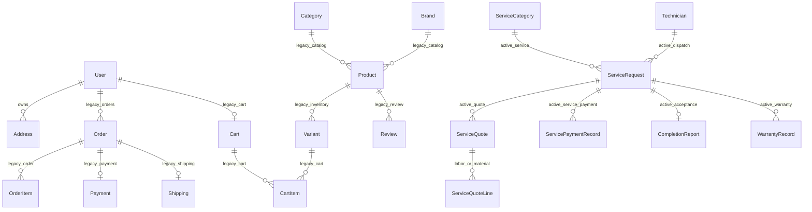

# Báo cáo ảnh hưởng schema — service-only v1.0

Ngày khóa thiết kế: 2026-07-18
Migration: `20260718120000_phase5_safe_legacy_booking`
Nguyên tắc phát hành: **expand-only, không DROP, có đường rollback**.

## Kết luận

V1.0 không xóa bảng bán hàng. Runtime service-only không expose chúng, còn dữ liệu được giữ nguyên để rollback có kiểm chứng. Migration chỉ thêm metadata legacy và các cấu trúc phục vụ đặt lịch an toàn. Việc xóa vật lý chỉ được xem xét ở v1.1 sau phê duyệt, backup có checksum và restore drill PASS.

## Sơ đồ quan hệ trước thay đổi

Các quan hệ có nhãn `legacy_*` vẫn tồn tại trong DB nhưng bị chặn ở controller/service theo service-only contract. Các quan hệ `active_*` là nghiệp vụ dịch vụ và tuyệt đối không được xóa nhầm với commerce.

## Thay đổi additive v1.0

| Thành phần | Thay đổi | Mục đích | Rollback ứng dụng |
|---|---|---|---|
| `LegacyDomainMetadata` | Bảng mới | Registry xác nhận bảng legacy chỉ-đọc, không expose runtime | Code cũ bỏ qua bảng |
| `ServiceCategory` | 4 cột giá tham khảo/phí khảo sát | Công khai khoảng giá, không giả định giá chốt | Nullable/default an toàn |
| `ServiceRequest` | 5 cột snapshot disclosure | Lưu đúng thông tin giá khách đã thấy lúc gửi | Code cũ bỏ qua cột |
| `ServiceRequestSubmission` | Bảng mới, khóa hash unique | Idempotency khi gửi lặp | Code cũ bỏ qua bảng |
| `ServiceRequestScheduleChange` | Bảng mới | Audit đổi lịch + phiên bản trước/sau | Code cũ bỏ qua bảng |

Migration đã được architecture test chặn các token phá hủy (`DROP`, `TRUNCATE`, `RENAME`, `DELETE FROM`) và chặn việc biến `ServiceQuoteLine`/`ServicePaymentRecord` thành legacy.

## Ma trận dữ liệu giữ lại

- Legacy/rollback: `Category`, `Brand`, `Product`, `ProductImage`, `Variant`, `Cart`, `CartItem`, `Order`, `OrderItem`, `Payment`, `Shipping`, `Coupon`, `Review`.
- Active service: `ServiceRequest`, `ServiceCategory`, `Technician`, `ServiceQuote`, `ServiceQuoteLine` (LABOR/MATERIAL), `ServicePaymentRecord`, `CompletionReport`, `WarrantyRecord`, notification/outbox và audit.
- Không có backfill nào làm thay đổi dữ liệu commerce.
- Giá tham khảo mặc định được seed ở mức bảo thủ; quản trị viên phải hiệu chỉnh theo danh mục thực tế trước production.

## Quy trình migrate và rollback

1. Tạo backup nén + SHA-256 bằng `scripts/backup-mysql.mjs`.
2. Restore vào DB drill độc lập và kiểm tra số dòng legacy/service.
3. Chạy `prisma migrate deploy` trên DB drill trước production.
4. Chạy critical-flow E2E và đối chiếu checksum/count.
5. Production deploy ứng dụng service-only; không chạy `migrate dev`.
6. Khi rollback ứng dụng, schema mới vẫn tương thích vì chỉ có bảng/cột additive.

## Điều kiện v1.1 mới được DROP

- Có phê duyệt thay đổi riêng và danh sách bảng chính xác.
- Có ít nhất một backup checksum hợp lệ, restore drill PASS và thời gian phục hồi được ghi nhận.
- Không còn foreign key hoặc truy vấn runtime phụ thuộc.
- Dữ liệu LABOR/MATERIAL, quotation, service payment, completion và warranty được chứng minh không nằm trong phạm vi xóa.

## Kết quả kiểm chứng

Trạng thái local: schema validate, architecture/contract tests và build được chạy trong PR.
Trạng thái DB thật: workflow `Phase 5-6 database drill` chạy hai đường **clean migrate** và **legacy backup → restore → migrate** trên MySQL 8.4. Chỉ ghi “PASS” vào PR sau khi workflow xanh.
